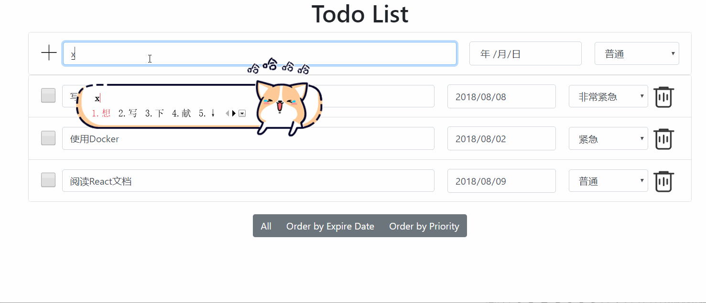
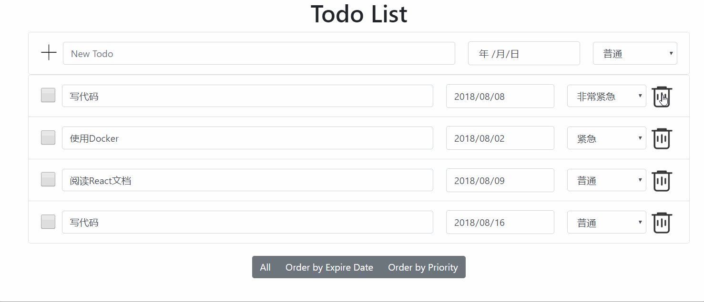
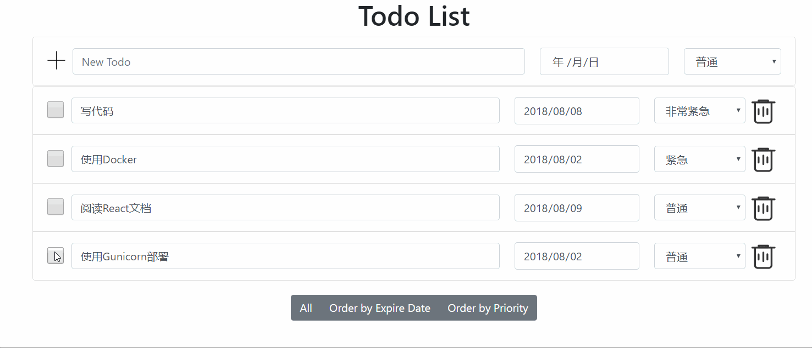
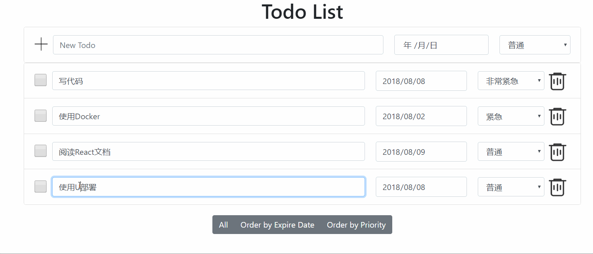
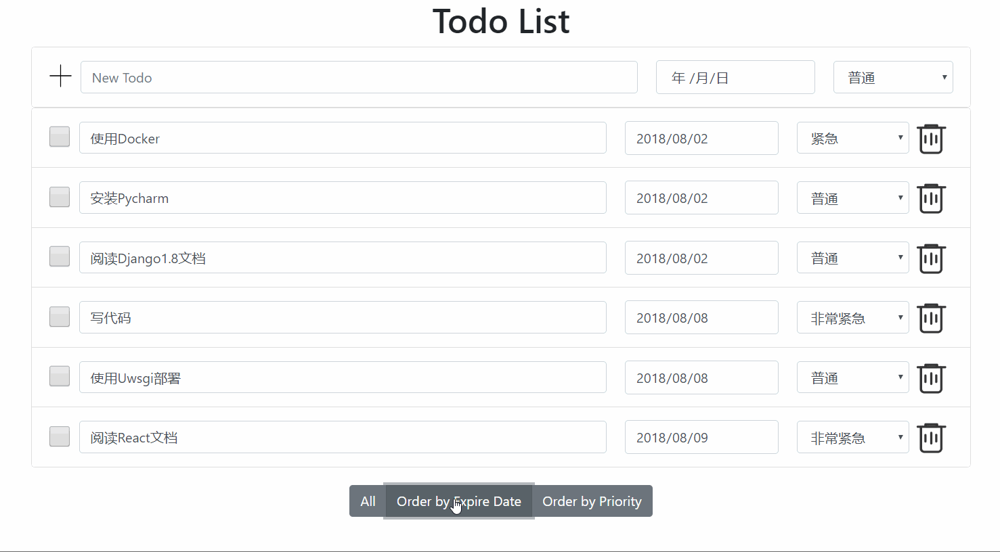

# Todo List

## 完成的功能

- [x] 增加一个待办事项
- [x] 删除一个待办事项
- [x] 标记一个待办事项为已完成
- [x] 编辑一个待办事项的具体内容
- [x] 列出所有的待办事项
- [x] 待办事项可以设置优先级
- [x] 待办事项可以设置expire date
- [x] 支持按照不同的方式排序，如优先级，expire date

功能GIF截图

- 增加一个待办事项

- 删除一个待办事项

- 增加一个待办事项为已完成

- 编辑一个待办事项的具体内容

- 列出所有的待办事项
- 待办事项可以设置优先值
- 待办事项可以设置expire_date
- 支持按照不同的方式排序，如优先值，expire_date

